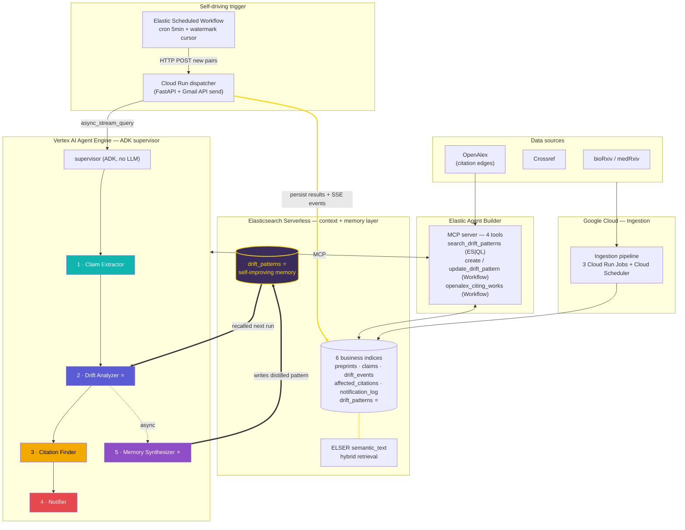
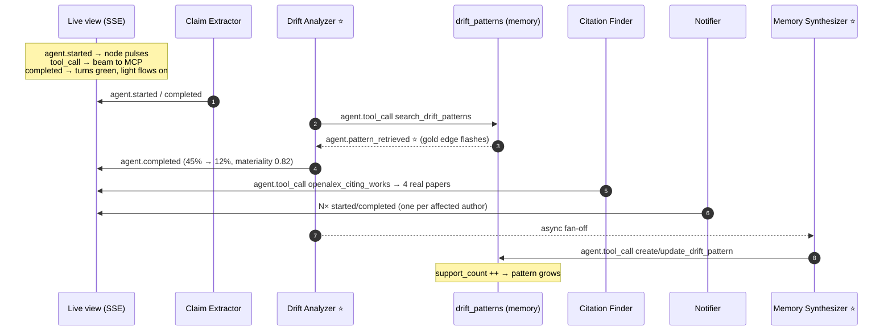

# ClaimDrift — Demo Video Assets

> Brainstorm output (2026-05-29): demo video shot-list + architecture diagrams + frontend
> design notes. Source of truth for D's video work. Diagrams are Mermaid — render in any
> Mermaid-capable viewer (VS Code preview, mermaid.live, GitHub).

---

## Agent theme colors (visual motif — reuse everywhere)

These five colors are the through-line of the whole video. Same color = same agent in the
architecture diagram, the Live view pipeline, and the shot-list. By 1:00 the viewer should
recognize "the indigo block = Drift Analyzer" on sight.

| Agent | Model | Color | Hex |
|---|---|---|---|
| Claim Extractor | gemini-2.5-flash | teal | `#0FB5AE` |
| Drift Analyzer ⭐ | gemini-2.5-pro | indigo | `#5B5BD6` |
| Citation Finder | gemini-2.5-flash | amber | `#F2A900` |
| Notifier | gemini-2.5-flash | rose | `#E5484D` |
| Memory Synthesizer ⭐ | gemini-2.5-pro | violet | `#8E4EC6` |
| (memory loop edge) | — | gold glow | `#FFD60A` |

---

## Diagram 1 — Main architecture (shown at S3 as the "global map", recalled at S8)

Emphasis: the GCP × Elastic dual-stack collaboration and the self-improving memory loop.
Shown FIRST at S3 (right after the live-action VO starts) so every later step (S4–S7) maps
back onto this map; recalled at S8 with the gold memory edge highlighting last.

**One-line caption for the video:** *"Five Gemini agents on Vertex AI, Elastic as the
context + memory layer over MCP, a closed loop that learns from every drift it finds."*

---

## Diagram 2 — Agent pipeline swimlane (reference for D's "light up in real time" S4)

This maps 1:1 to the real SSE event stream (contracts §6.1). Each node's lit/green/red state
is driven by a real `agent.*` event — NOT a fake animation. Use `SSE_REPLAY_GOLDEN=1` to
replay the real `stream_amblyopia_v2.jsonl` golden stream at 0.6s/frame.

**The money frame (S7):** on the SECOND drift run, the `pattern_retrieved` gold flash fires
almost instantly (analyzer recalls the pattern it learned), and `support_count` jumps 1 → 2.
Record run #1 and run #2 side by side to show the speedup.

---

## Frontend design recommendations (for D — current FE is v0, iterate freely)

### 1. Live view → "pipeline EKG" (highest priority)
Upgrade `/live` from a flat SSE list to a **horizontal pipeline** of the 5 agent nodes, with
the timeline list below it. State transitions driven by real SSE events:
- `agent.started` → node lights up + breathing pulse (theme color)
- `agent.tool_call` → node fires a beam down to the MCP tool layer
- `agent.pattern_retrieved` → **gold edge between Drift Analyzer ↔ drift_patterns flashes**
  (this is the visible proof of the memory loop — the single most important frame)
- `agent.completed` → node turns green, light flows to next agent
- `agent.failed` → node turns red

### 2. A dedicated "memory bank" visual symbol
Draw `drift_patterns` as a glowing memory bank. On each `agent.pattern_retrieved`, a pattern
card flies out of the bank up to the Drift Analyzer. On run #2 it flies out faster / hits
immediately — the visual proof of self-improvement.

### 3. Patterns view → "a growing brain"
Each pattern card shows `support_count` (how many drift events back it); higher = brighter /
bigger card. Demo beat: empty before drift #1 → one card after → reused by drift #2 (count→2).

### 4. Unified color semantics
Each agent keeps its theme color (table above) across architecture diagram, Live view, and
shot-list, so the viewer builds muscle memory within the 3 minutes.

---

## Shot-list (3:00 hard cap — target 2:50, only first 3 min are judged)

Arc: **Problem (Impact) → real run (Tech) → self-improvement (Idea)**. Architecture map is
shown UP FRONT (S3) so the deep dives that follow map onto it, then recalled at the close.

| # | Time | Beat | Visual | VO (English / EN subtitles required) | Judging hit |
|---|---|---|---|---|---|
| S1 | 0:00–0:18 | 🎬 Problem (anim) | Preprint "reduced viral load by 45%", cited by many; number quietly morphs 45%→12%, citations stay lit, unaware | "A preprint claims a 45% effect. Dozens of papers cite it. Then peer review quietly cuts it to 12%—and everyone downstream never finds out." | Impact |
| S2 | 0:18–0:35 | 💡 Value (anim→logo) | Citation links turn red one by one; logo + tagline; sources slide in (bioRxiv·medRxiv·Crossref·OpenAlex) | "ClaimDrift watches every preprint as it becomes a published paper, detects the drift in its claims, and warns the researchers who relied on it." | Impact + Idea |
| 🔀 | 0:35–0:36 | Transition | 1s geometric transition + whoosh SFX; flat anim → real browser | (SFX only) | — |
| S3 | 0:36–0:58 | 🏗️ Overview + **architecture map** (VO+screen) | Live-action VO starts. Show **Diagram 1** as the global map (data-flow light traces the loop once), THEN cut to real FE home `/` — drift events list, "~10k preprints / ~2.2k pairs" badge | "This is ClaimDrift on Google Cloud. Here's the whole system: five Gemini agents on Vertex AI, Elastic as the context and memory layer over MCP. Every drift event you'll see is real—detected automatically, no human in the loop." | Design + Tech |
| S4 | 0:58–1:24 | ⚡ Pipeline lights up (screen) | `/live` with `SSE_REPLAY_GOLDEN`; 5 nodes light up in sequence; gold memory-card flies to Drift Analyzer | "Watch it work. An Elastic scheduled workflow fires every five minutes, hands the job to our ADK supervisor, and five Gemini agents light up in real time—each calling Elastic tools over MCP." | **Tech** |
| S5 | 1:24–1:44 | 🔬 Drift evidence (screen) | `/event/[id]` claim diff 45%→12% red highlight, materiality 0.82; `/citations` 4 real OpenAlex papers + severity tiers | "Here's the drift, claim by claim. Effect size cut by 73%. And the four real downstream papers that cite it—ranked by how badly they depend on the broken claim." | Tech + Impact |
| S6 | 1:44–2:02 | ✉️ Notify (screen) | `/notifications`; auto-drafted+sent Gmail quoting full sentences + links; one email per author | "Each affected author gets a personalized, non-judgmental heads-up—drafted by Gemini, sent through the Gmail API." | Tech + Design |
| S7 | 2:02–2:38 | 🧠 **Climax: self-improvement** (screen+anim) | `/patterns` gains a card (numerical_softening, count=1); run drift #2 → Drift Analyzer recalls it almost instantly, count→2; side-by-side run1 vs run2 | "But here's what makes ClaimDrift different. Every drift it finds is distilled into a reusable pattern, written back into Elasticsearch. So next time, the analyzer recalls what it learned—and gets faster and sharper. The system improves itself." | **Idea** + Tech |
| S8 | 2:38–3:00 | 🎯 Close (anim+logo) | Quick recall of **Diagram 1**; the gold memory-loop edge highlights LAST; logo + tagline + repo/hosted URL | "Five agents, one self-improving memory loop, fully autonomous. ClaimDrift—because science shouldn't drift in silence." | All |

### Production guardrails
- **Cap at 2:50** for buffer; only first 3:00 are judged — when in doubt, cut.
- **S4 / S7 use `SSE_REPLAY_GOLDEN=1`** (real golden stream, stable, reproducible without GCP creds — contracts §6.3). Best of both: real production events + no 200s live-run risk.
- **English subtitles mandatory** (rules). No third-party ads/sponsor logos; GCP/Elastic shown as tech stack is fine, keep it tasteful.
- Royalty-free BGM; clean transition SFX.
- Judging is 4 EQUAL-weighted criteria: Technological Implementation · Design · Potential Impact · Quality of Idea. The arc above deliberately lands one beat on each.
